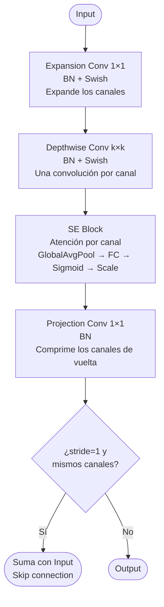
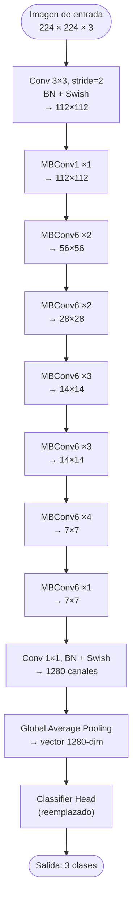
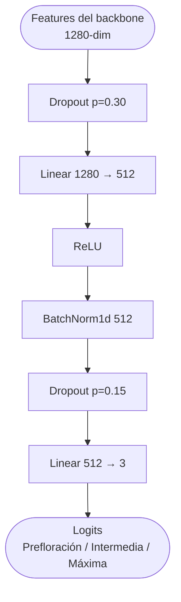
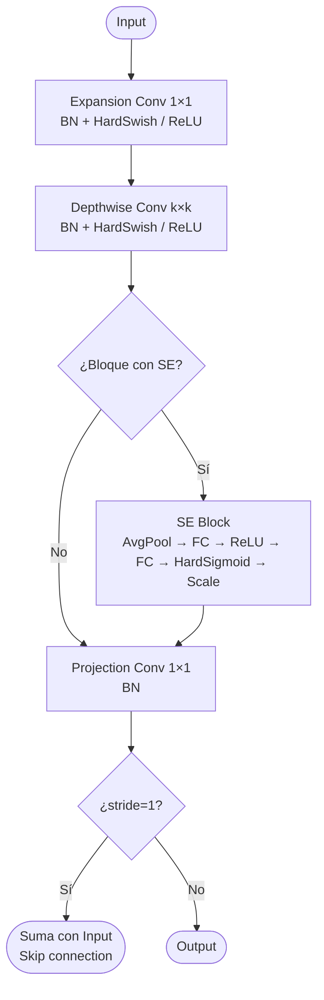
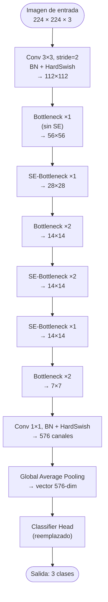
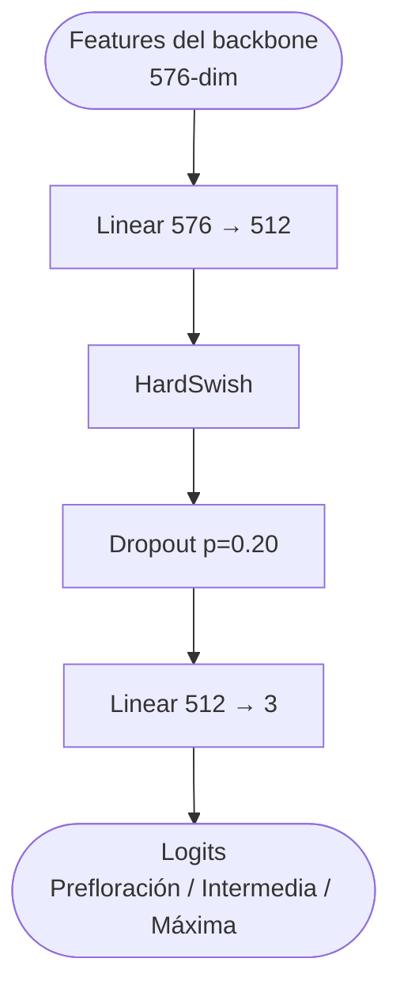
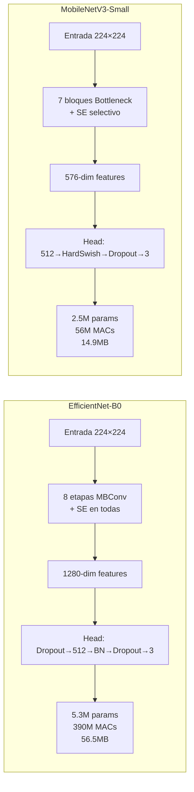
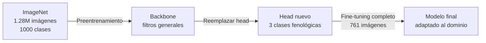

# Arquitecturas de los Modelos Propuestos

## ¿Por qué estas dos arquitecturas?

El sistema debe correr en una cámara OAK-1 con hardware muy limitado (~1 TOPS, 512 MB RAM). Eso descarta redes grandes. **EfficientNet-B0** y **MobileNetV3-Small** son dos de las arquitecturas más eficientes disponibles para clasificación de imágenes, y ambas fueron diseñadas explícitamente para dispositivos con recursos restringidos.

La pregunta que guía la comparación es: ¿cuánta precisión ganamos con EfficientNet-B0 respecto a MobileNetV3-Small, y a qué costo computacional?

---

## 1. EfficientNet-B0

### ¿Qué idea tiene detrás?

La mayoría de las redes se hacen más precisas haciéndolas más profundas (más capas), más anchas (más filtros) o aumentando la resolución de entrada. EfficientNet propone hacer las tres cosas **a la vez y en proporción**, usando un único coeficiente de escala $\phi$:

$$d = \alpha^\phi \quad w = \beta^\phi \quad r = \gamma^\phi$$

Para EfficientNet-B0, $\phi = 1$ con $\alpha=1.2$, $\beta=1.1$, $\gamma=1.15$. Es el modelo base de la familia — el más pequeño — pero ya incorpora el principio de escala compuesta.

### Bloque fundamental: MBConv

Cada etapa de la red repite un bloque llamado **MBConv** (Mobile Inverted Bottleneck). La idea es procesar la imagen en un espacio expandido (más canales), aplicar la convolución ahí, y volver a comprimir. Esto es más eficiente que una convolución estándar.

El **bloque SE** (Squeeze-Excitation) es lo que diferencia a EfficientNet de redes más simples: aprende a darle más importancia a ciertos canales (características) y menos a otros, funcionando como un mecanismo de atención sobre los filtros.

La activación **Swish** también es distintiva:

$$\text{Swish}(x) = x \cdot \sigma(x) = \frac{x}{1 + e^{-x}}$$

Es suave y no tiene un límite superior, lo que ayuda al flujo de gradientes durante el entrenamiento.

### Arquitectura completa adaptada

### Classifier head

El head original de EfficientNet fue reemplazado por uno más robusto para nuestro dominio:

El dropout en dos etapas (0.30 → 0.15) aplica más regularización en la transición desde el backbone y menos antes de la clasificación final. BatchNorm1d estabiliza la distribución de activaciones en las 512 dimensiones intermedias.

### Especificaciones

| Parámetro | Valor |
|-----------|-------|
| Parámetros totales | 5.3 M |
| MACs por inferencia | 390 M |
| Tamaño (FP32) | 56.5 MB |
| Resolución de entrada | 224 × 224 |
| Activación | Swish |
| Dropout | 0.30 / 0.15 (dos etapas) |

---

## 2. MobileNetV3-Small

### ¿Qué idea tiene detrás?

MobileNetV3-Small fue diseñado con un objetivo muy concreto: **mínima latencia en hardware móvil**. Para lograrlo combina dos estrategias:

1. **Búsqueda de arquitectura automática (NAS)**: un algoritmo busca la combinación óptima de capas para maximizar exactitud por unidad de latencia.
2. **Ajuste manual** de las capas de entrada y salida, que NAS tiende a hacer ineficientes.

El resultado es una red que usa 7 veces menos operaciones que EfficientNet-B0, manteniendo una precisión comparable o superior en tareas de dominio específico.

### Bloque fundamental: Bottleneck con SE selectivo

Comparte la estructura MBConv de EfficientNet, pero el módulo SE solo está presente en algunos bloques (no en todos), reduciendo el costo computacional. Además, reemplaza Swish por **HardSwish**:

**HardSwish** es una aproximación lineal por partes de Swish que evita calcular exponenciales:

$$\text{HardSwish}(x) = x \cdot \frac{\text{ReLU6}(x + 3)}{6}$$

En hardware sin soporte nativo para operaciones exponenciales (como el Myriad X de OAK-1), esto se traduce en una aceleración real de inferencia.

### Arquitectura completa adaptada

La red termina con solo **576 dimensiones** antes del head (vs 1280 de EfficientNet). Esto es posible porque cada bloque fue optimizado para retener solo la información más relevante.

### Classifier head

El head usa HardSwish en lugar de ReLU para mantener consistencia con la activación del backbone, evitando discontinuidades en la distribución de gradientes durante el fine-tuning. Es más simple que el head de EfficientNet — no necesita BatchNorm intermedio porque la red base ya es más estable.

### Especificaciones

| Parámetro | Valor |
|-----------|-------|
| Parámetros totales | 2.5 M |
| MACs por inferencia | 56 M |
| Tamaño (FP32) | 14.9 MB |
| Resolución de entrada | 224 × 224 |
| Activación | HardSwish |
| Dropout | 0.20 (una etapa) |

---

## 3. Comparación directa

| Criterio | EfficientNet-B0 | MobileNetV3-Small |
|----------|:--------------:|:-----------------:|
| Parámetros | 5.3 M | **2.5 M** |
| MACs | 390 M | **56 M** |
| Tamaño modelo | 56.5 MB | **14.9 MB** |
| Activación backbone | Swish | HardSwish |
| SE en todos los bloques | Sí | Solo en algunos |
| Latencia en CPU | 42.78 ms | **7.57 ms** |
| Accuracy (test) | 90.52% | **91.38%** |
| F1-Score Macro | 0.881 | **0.902** |

MobileNetV3-Small requiere **7 veces menos operaciones** y es **5.7 veces más rápido**, y aun así obtiene mejor F1-Score. Esto se explica porque con un dataset pequeño (761 imágenes), un modelo más compacto generaliza mejor: tiene menos capacidad para memorizar el conjunto de entrenamiento.

---

## 4. Transfer Learning: punto de partida compartido

Ambas arquitecturas se inicializan con **pesos preentrenados en ImageNet-1K** (1.28 millones de imágenes, 1000 clases). Esto significa que los filtros del backbone ya saben detectar bordes, texturas, formas y patrones generales antes de ver una sola imagen de *Callistephus chinensis*.

Se aplica **fine-tuning completo** (sin congelar capas): todos los pesos se actualizan durante el entrenamiento. Esto es apropiado cuando el dataset es pequeño y las clases son muy específicas de dominio — las texturas florales de *Callistephus chinensis* no tienen correspondencia directa con categorías ImageNet.
