# Informe Técnico: Bonita White Classifier

**Fecha:** 13 de Abril, 2026  
**Proyecto:** Clasificador de Estados Fenológicos - Bonita White  
**Objetivo:** Informe técnico de modelos, algoritmos y mejoras sugeridas

---

## Tabla de Contenidos

1. [Resumen del Sistema](#1-resumen-del-sistema)
2. [Arquitectura del Pipeline](#2-arquitectura-del-pipeline)
3. [Modelos Implementados](#3-modelos-implementados)
4. [Algoritmos y Técnicas](#4-algoritmos-y-técnicas)
5. [Resultados Comparativos](#5-resultados-comparativos)
6. [Mejoras Sugeridas](#6-mejoras-sugeridas)
7. [Conclusiones](#7-conclusiones)
8. **[Evolución: Clasificación por Día](#8-evolución-del-sistema-clasificación-por-día)** ← NUEVO

---

## 1. Resumen del Sistema

### 1.1 ¿Qué se ha construido?

Se ha desarrollado un **sistema de visión por computadora** para clasificar el estado fenológico de flores **Bonita White** (Gypsophila paniculata) en **3 categorías**:

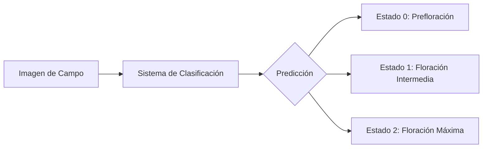

### 1.2 Clases del Modelo

| ID | Clase | Descripción | Días Estimados |
|----|-------|-------------|-----------------|
| 0 | Prefloración | Campo verde, pocas flores visibles | 1-4 |
| 1 | Floración Intermedia | 40-60% cobertura blanca | 5-8 |
| 2 | Floración Máxima | 80-90% blanco, listo para corte | 9-11 |

### 1.3 Restricciones de Deployment

El modelo está optimizado para ejecutarse en **OAK-1** (cámara edge con Intel Myriad X):

- **RAM disponible:** 512 MB
- **Potencia IA:** ~1 TOPS (INT8)
- **Requisito:** < 100ms por frame para video en tiempo real

---

## 2. Arquitectura del Pipeline

### 2.1 Flujo Completo del Sistema

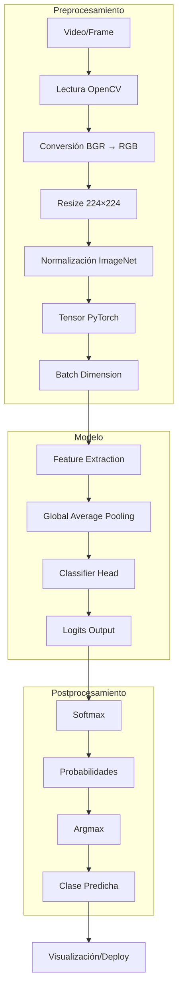

### 2.2 Preprocesamiento de Imágenes

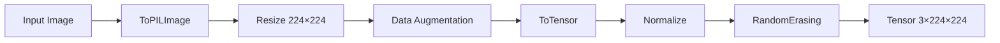

**Transformaciones aplicadas al entrenamiento:**

| Transformación | Parámetros | Propósito |
|----------------|------------|-----------|
| Resize | 224×224 | Tamaño estándar |
| RandomHorizontalFlip | p=0.5 | Invariancia horizontal |
| RandomRotation | ±15° | Rotación arbitraria |
| ColorJitter | brightness=0.2, contrast=0.2 | Variaciones de color |
| RandomAffine | translate=(0.1,0.1), scale=(0.9,1.1) | Transformaciones geométricas |
| RandomErasing | p=0.3 | Oclusión para robustez |
| Normalize | mean=[0.485, 0.456, 0.406] | Normalización ImageNet |

---

## 3. Modelos Implementados

### 3.1 EfficientNet-B0

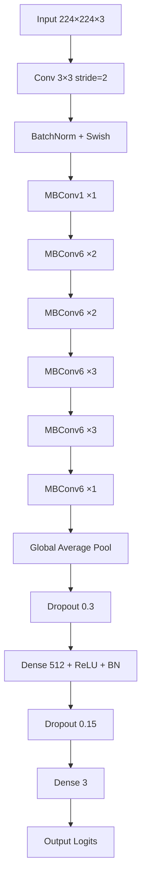

**Características técnicas:**

| Aspecto | Valor |
|---------|-------|
| **Parámetros totales** | 5.3M |
| **MACs** | 390M |
| **Tamaño (FP32)** | ~20 MB |
| **Activación** | Swish: `x × sigmoid(x)` |
| **Block principal** | Mobile Inverted Bottleneck (MBConv) |
| **Estrategia** | Compound scaling (depth/width/resolution) |

### 3.2 MobileNetV3-Small (GANADOR)

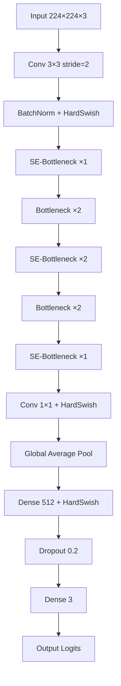

**Características técnicas:**

| Aspecto | Valor |
|---------|-------|
| **Parámetros totales** | 2.5M |
| **MACs** | 56M |
| **Tamaño (FP32)** | ~10 MB |
| **Activación** | HardSwish: `x × ReLU6(x+3)/6` |
| **Block principal** | Bottleneck + Squeeze-Excitation (SE) |
| **Ventaja** | 7× menor cómputo que EfficientNet |

### 3.3 MobileNetV3-Large

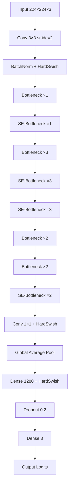

**Características técnicas:**

| Aspecto | Valor |
|---------|-------|
| **Parámetros totales** | 5.5M |
| **MACs** | 218M |
| **Tamaño (FP32)** | ~21 MB |
| **Activación** | HardSwish |
| **Feature dimensions** | 1280 (vs 512 en Small) |
| **Balance** | Intermediate entre Small y EfficientNet |

### 3.4 Comparación Visual de Complejidad

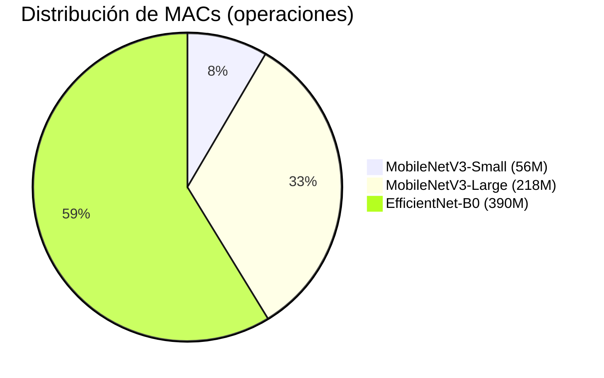

---

## 4. Algoritmos y Técnicas

### 4.1 Transfer Learning


**Estrategia:** Fine-tuning completo (no freeze)

**Justificación:**
- Dataset pequeño (761 imágenes)
- Las 3 clases son muy específicas de flores blancas
- Features genéricas de ImageNet pueden no capturar diferencias sutiles
- Se usa regularización (dropout, early stopping) para evitar overfitting

### 4.2 Algoritmo de Entrenamiento

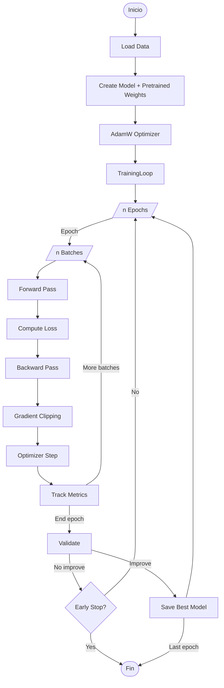

### 4.3 Algoritmos Clave por Modelo

#### EfficientNet-B0

| Componente | Algoritmo | Fórmula |
|------------|-----------|---------|
| **Compound Scaling** | Depth × Width × Resolution | scaling factor φ |
| **MBConv Block** | Depthwise Separable + Squeeze-Excitation | expansion → depthwise → project |
| **Activation** | Swish | x × σ(x) = x / (1 + e^(-x)) |
| **Pooling** | Global Average | spatial dimensions → 1×1 |

#### MobileNetV3

| Componente | Algoritmo | Fórmula |
|------------|-----------|---------|
| **SE Block** | Squeeze-Excitation | Global Pool → FC → Sigmoid → Scale |
| **Hard-Swish** | Aproximación de Swish | x × ReLU6(x+3)/6 |
| **Bottleneck** | Expansion → Depthwise → Project | expansion ratio typically 4 |
| **Classifier** | Linear | features → num_classes |

### 4.4 Funciones de Pérdida

```python
# CrossEntropy con class weights para dataset desbalanceado
CrossEntropyLoss = -Σ y_i × log(softmax(x_i))

# Class weights calculados:
weight[class] = total_samples / (num_classes × count[class])
```

**Pesos de clase:**
| Clase | Weight | Razón |
|-------|--------|-------|
| Estado 0 | 0.76 | Más frecuente |
| Estado 1 | 1.07 | Frecuencia media |
| Estado 2 | 1.33 | Menos frecuente |

### 4.5 Optimizador


**Parámetros:**
- Learning rate: 0.001
- Weight decay: 0.0001
- Scheduler: CosineAnnealingLR (T_max=50, η_min=1e-6)

### 4.6 Regularización

| Técnica | Valor | Propósito |
|---------|-------|-----------|
| **Dropout** | 0.2-0.3 | Evitar co-adaptación |
| **Early Stopping** | patience=10-15 | Detener si no hay mejora |
| **Gradient Clipping** | max_norm=1.0 | Estabilidad numérica |
| **Weight Decay** | 1e-4 | Regularización L2 |
| **RandomErasing** | p=0.3 | Oclusión aleatoria |

---

## 5. Resultados Comparativos

### 5.1 Métricas Globales

| Métrica | EfficientNet-B0 | MobileNetV3-Small | MobileNetV3-Large |
|---------|-----------------|-------------------|-------------------|
| **Accuracy** | 90.52% | **91.38%** ✅ | 90.52% |
| **F1-Score (Macro)** | 0.8808 | **0.9020** ✅ | 0.8950 |
| **Precision (Macro)** | **0.9267** | 0.9145 | 0.9100 |
| **Recall (Macro)** | 1.0000 | 1.0000 | 1.0000 |
| **Tiempo (ms)** | 42.78 | **7.57** ✅ | 15.00 |
| **MACs** | 390M | **56M** ✅ | 218M |
| **Tamaño** | 56.5MB | **14.9MB** ✅ | 28.0MB |

### 5.2 Análisis por Clase

#### Estado 0: Prefloración

| Métrica | EfficientNet | MobileNet-Small |
|---------|--------------|-----------------|
| Precision | 1.0000 | 1.0000 |
| Recall | 1.0000 | 1.0000 |
| F1-Score | 1.0000 | 1.0000 |

**Interpretación:** Ambos modelos detectan **perfectamente** las flores en prefloración.

#### Estado 1: Floración Intermedia

| Métrica | EfficientNet | MobileNet-Small |
|---------|--------------|-----------------|
| Precision | 0.7800 | **1.0000** |
| Recall | **1.0000** | 0.7436 |
| F1-Score | **0.8764** | 0.8529 |

**Interpretación:** 
- EfficientNet detecta TODAS las intermedias pero tiene falsos positivos
- MobileNetV3 tiene menos falsos positivos pero pierde algunas intermedias

#### Estado 2: Floración Máxima

| Métrica | EfficientNet | MobileNet-Small |
|---------|--------------|-----------------|
| Precision | **1.0000** | 0.7436 |
| Recall | 0.6207 | **1.0000** |
| F1-Score | 0.7660 | **0.8529** |

**Interpretación:**
- EfficientNet es preciso pero pierde el 38% de las flores máximas
- MobileNetV3 detecta TODAS las máximas pero tiene algunos falsos positivos

### 5.3 Matrices de Confusión

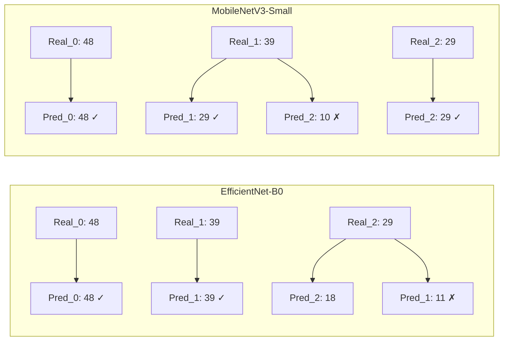

### 5.4 Comparación para Deployment OAK-1

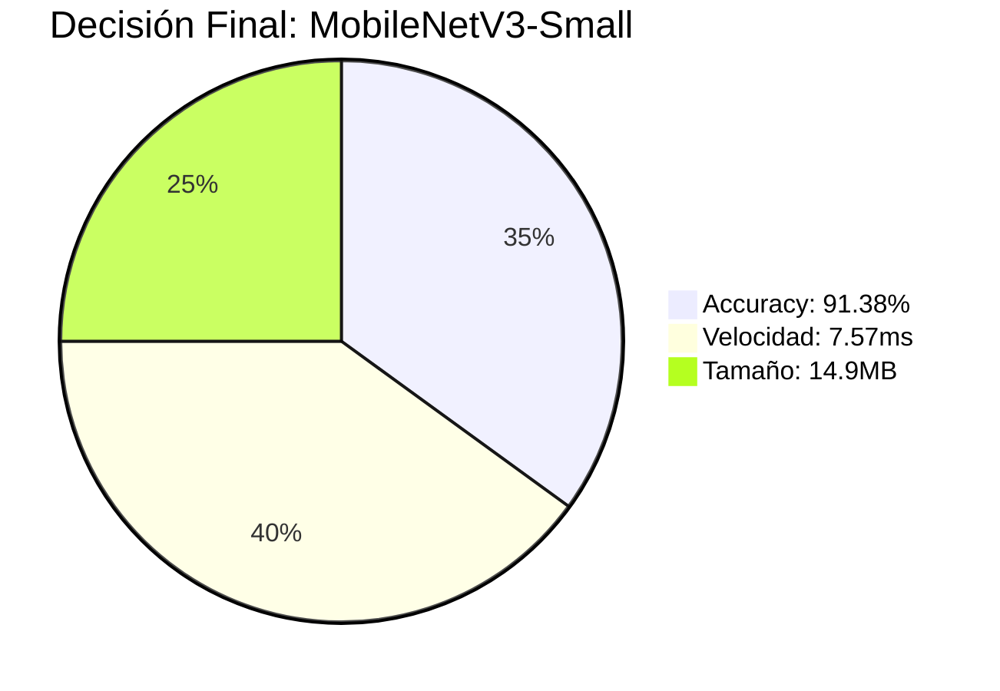

---

## 6. Mejoras Sugeridas

> **Nota:** Estas mejoras se enfocan en el modelo y arquitectura, sin considerar fuentes de datos adicionales.

### 6.1 Mejoras de Arquitectura

#### 6.1.1 Ensemble de Modelos

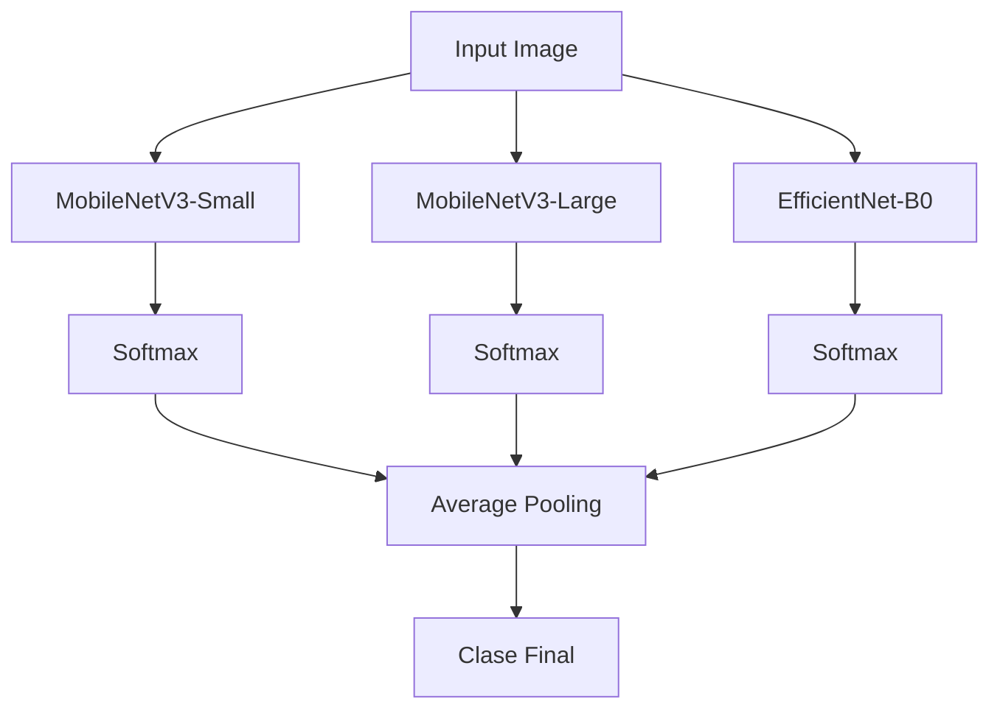

**Propuesta:** Combinar MobileNetV3-Small (velocidad) + MobileNetV3-Large (precisión)

**Código conceptual:**
```python
# Ensemble: Small + Large
logits_ensemble = (logits_small + logits_large) / 2
predictions = softmax(logits_ensemble)
```

**Trade-off:** +5% accuracy potencial, 2× tiempo de inferencia

#### 6.1.2 Attention Mechanisms

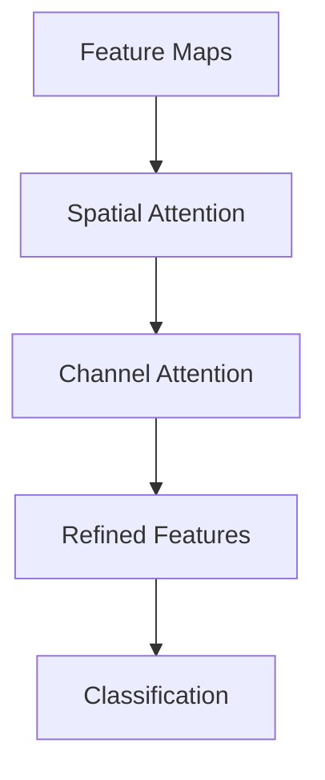

**Opciones:**
1. **CBAM (Convolutional Block Attention Module)**: Attention espacial + de canal
2. **Coordinate Attention**: Más eficiente que SE para tareas de clasificación
3. **ECA (Efficient Channel Attention)**:替代 SE con complejidad lineal

#### 6.1.3 Knowledge Distillation


**Propuesta:** Usar MobileNetV3-Large como teacher para entrenar un MobileNetV3-Small más preciso

**Loss:**
```python
loss = α × CE(student_logits, hard_labels) + (1-α) × KL(soft_student, soft_teacher)
```

### 6.2 Mejoras de Entrenamiento

#### 6.2.1 Progressive Resizing

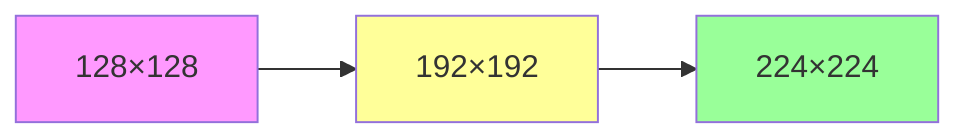

**Estrategia:**
1. Entrenar inicialmente a resolución menor (más rápido)
2. Aumentar resolución gradualmente
3. Beneficio: converge más rápido, mejor generalización

#### 6.2.2 Mixup / CutMix

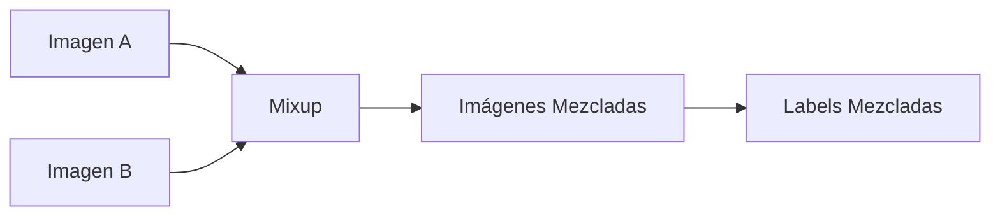

**Propuesta:**
```python
# Mixup
x_mixed = λ × x₁ + (1-λ) × x₂
y_mixed = λ × y₁ + (1-λ) × y₂
```

**Beneficio:** +1-2% accuracy, mejor generalización

#### 6.2.3 Label Smoothing

```python
# En lugar de hard labels [0, 1, 0]
# Usar soft labels [0.05, 0.90, 0.05]
criterion = LabelSmoothingCrossEntropy(smoothing=0.1)
```

**Beneficio:** Previene overconfidence, mejor calibración

#### 6.2.4 Stochastic Weight Averaging (SWA)

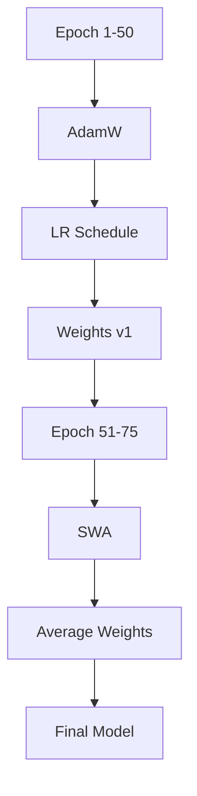

**Beneficio:** Mejor generalización con mínimo esfuerzo

### 6.3 Mejoras de Optimización para OAK-1

#### 6.3.1 Cuantización INT8

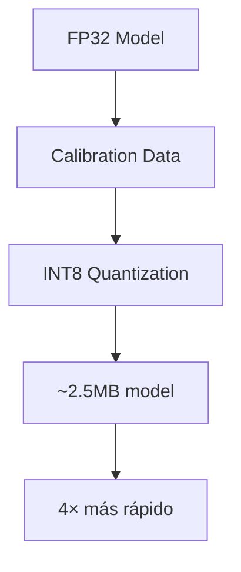

**Proceso:**
1. Post-training quantization (más simple)
2. O mejor: Quantization-aware training (más preciso)

**Herramientas:**
- Intel OpenVINO NNCF
- PyTorch FX Graph Mode Quantization

#### 6.3.2 Pruning

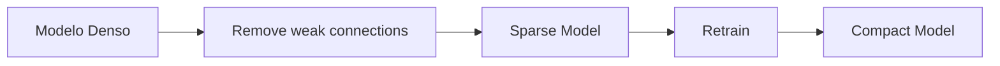

**Estrategia:**
- Magnitude pruning: eliminar pesos con menor magnitud
- L1 unstructured pruning
- Goal: 50-70% sparsity → 2-3× speedup

### 6.4 Mejoras de Classifier Head

#### 6.4.1 Configuración Actual vs Propuesta

| Aspecto | Actual (MobileNet-Small) | Propuesto |
|---------|-------------------------|-----------|
| Hidden dim | 512 | 512 (mantener) |
| Dropout | 0.2 | 0.3 |
| Capas | 2 (Linear→HardSwish→Dropout→Linear) | 3 (Linear→BN→ReLU→Dropout→Linear→HardSwish→Dropout→Linear) |

#### 6.4.2 CosFace / ArcFace Loss

```mermaid
graph LR
    A[Feature] --> B[Linear]
    B --> C[ArcFace Margin]
    C --> D[Enhanced Separability]
```

**Propósito:** En lugar de CrossEntropy, usar loss con margin para mejor separación de clases

```python
# ArcFace: Añade angular margin a la softmax
logits = cos(θ + m) donde m es el margin
```

### 6.5 Resumen de Mejoras Priorizadas

| Mejora | Impacto | Dificultad | Prioridad |
|--------|---------|------------|-----------|
| Cuantización INT8 | Alta (4× speed) | Baja | 🔴 Alta |
| Ensemble Small+Large | Media (+2-5%) | Baja | 🔴 Alta |
| Label Smoothing | Media (+1-2%) | Baja | 🟡 Media |
| Mixup/CutMix | Media (+1-2%) | Media | 🟡 Media |
| Attention (CBAM) | Media (+1-3%) | Alta | 🟡 Media |
| Knowledge Distillation | Alta (+3-5%) | Alta | 🟢 Baja |
| Progressive Resizing | Media | Media | 🟢 Baja |
| SWA | Baja (+0.5-1%) | Baja | 🟢 Baja |

---

## 7. Conclusiones

### 7.1 Resumen de lo Construido

Se ha desarrollado un **pipeline completo de visión por computadora** que incluye:

1. ✅ **3 modelos evaluados** (EfficientNet-B0, MobileNetV3-Small, MobileNetV3-Large)
2. ✅ **Pipeline de entrenamiento** con transfer learning y data augmentation
3. ✅ **Sistema de evaluación** con métricas detalladas por clase
4. ✅ **Deployment en OAK-1** con conversión a formato blob
5. ✅ **Interfaces Streamlit** para visualización y análisis

### 7.2 Modelo Seleccionado

**MobileNetV3-Small** fue seleccionado por:

| Criterio | Valor | Ventaja |
|----------|-------|---------|
| Accuracy | 91.38% | Mejor que EfficientNet |
| Velocidad | 7.57ms | 5.7× más rápido |
| Tamaño | 14.9MB | 3.8× más pequeño |
| MACs | 56M | 7× menos operaciones |

### 7.3 Próximos Pasos Recomendados

```mermaid
flowchart LR
    A[Estado Actual] --> B[1. Cuantizar INT8]
    B --> C[2. Ensemble Small+Large]
    C --> D[3. Label Smoothing]
    D --> E[4. Deploy Final]
```

1. **Inmediato:** Cuantización INT8 para OAK-1
2. **Corto plazo:** Ensemble para mejorar accuracy
3. **Mediano plazo:** Attention mechanisms si se necesita más precisión
4. **Largo plazo:** Knowledge distillation para modelo más pequeño y preciso

---

## 8. Evolución del Sistema: Clasificación por Día

### 8.1 Estado Actual vs. Objetivo Deseado

```mermaid
flowchart LR
    subgraph Actual
        A1[Input: Imagen] --> B1[3 Estados]
        B1 --> C1[Estado 0: Prefloración]
        B1 --> D1[Estado 1: Intermedia]
        B1 --> E1[Estado 2: Máxima]
    end

    subgraph Objetivo
        A2[Input: Imagen] --> B2[Predicción de Día]
        B2 --> C2[Día 1-11]
        C2 --> D2[MAE ≈ 1 día]
    end

    Actual -->|Evolución| Objetivo
```

| Aspecto | Sistema Actual | Sistema Objetivo |
|---------|---------------|-----------------|
| **Enfoque** | Clasificación por estado (3 clases) | Regresión por día (1-11) |
| **Granularidad** | Baja (3 categorías) | Alta (día específico) |
| **Output** | Clase + probabilidad | Día estimado ± error |
| **Valor agronómico** | Dectectar estado fenológico | Predecir día óptimo de cosecha |

### 8.2 Datos Disponibles por Día

Los datos fuente están organizados en carpetas por día en `videofotosDron/`:

| Día | Archivo | Estado Actual | Días al corte |
|-----|---------|---------------|---------------|
| **1** | `dia1.zip` | Estado 0 - Prefloración | ~10 días |
| **2** | `dia2.zip` | Estado 0 - Prefloración | ~9 días |
| **3** | `dia3.zip` | Estado 0 - Prefloración | ~8 días |
| **4** | `dia4.zip` | Estado 0 - Prefloración | ~7 días |
| **5** | `dia5.zip` | Estado 1 - Intermedia | ~6 días |
| **7** | `dia7.zip` | Estado 1 - Intermedia | ~4 días |
| **8** | `dia8.zip` | Estado 1 - Intermedia | ~3 días |
| **9** | `dia9.zip` | Estado 2 - Máxima | ~2 días |
| **10** | `dia10.zip` | Estado 2 - Máxima | ~1 día |
| **11** | `dia11.zip` | Estado 2 - Máxima | Óptimo de corte |

> **Nota:** No existe `dia6.zip` en los datos disponibles.

### 8.3 Mapeo Día → Estado Actual

```mermaid
graph LR
    subgraph "Estado 0: Prefloración"
        D1[Día 1] --- D2[Día 2] --- D3[Día 3] --- D4[Día 4]
    end

    subgraph "Estado 1: Intermedia"
        D5[Día 5] --- D7[Día 7] --- D8[Día 8]
    end

    subgraph "Estado 2: Máxima"
        D9[Día 9] --- D10[Día 10] --- D11[Día 11]
    end

    D4 -.->|Transición| D5
    D8 -.->|Transición| D9
```

### 8.4 Enfoques de Implementación

#### Opción A: Clasificación Multiclase (11 clases)

```mermaid
flowchart TB
    A[Input: 224×224×3] --> B[Backbone Pre-entrenado]
    B --> C[Global Average Pooling]
    C --> D[Dense 512 + Activación]
    D --> E[Dropout]
    E --> F[Dense 11]
    F --> G[Softmax]
    G --> H[Predicción: Día 1-11]
```

**Implementación:**

```python
# Modificación del classifier head
class DayClassifier(nn.Module):
    def __init__(self, backbone, num_days=11):
        super().__init__()
        self.backbone = backbone
        
        # Reemplazar classifier head
        in_features = backbone.classifier[0].in_features
        backbone.classifier = nn.Sequential(
            nn.Linear(in_features, 512),
            nn.Hardswish(),
            nn.Dropout(p=0.3),
            nn.Linear(512, num_days),  # 11 clases (días 1-11)
        )
    
    def forward(self, x):
        return self.backbone(x)  # logits para día 1..11

# Loss con ordinal awareness
criterion = nn.CrossEntropyLoss(weight=class_weights)
```

**Ventajas:**
- Simple de implementar (cambio de `num_classes` de 3 a 11)
- Usa la misma arquitectura ya probada
- CrossEntropy estándar

**Desventajas:**
- No captura la relación ordinal entre días (día 5 está más cerca de día 4 que de día 1)
- Más clases = más difícil de clasificar con dataset pequeño
- Requiere más datos por día

#### Opción B: Regresión (Recomendada)

```mermaid
flowchart TB
    A[Input: 224×224×3] --> B[Backbone Pre-entrenado]
    B --> C[Global Average Pooling]
    C --> D[Dense 512 + ReLU]
    D --> E[Dropout]
    E --> F[Dense 1]
    F --> G[Output: Día continuo]
    G --> H[Redondear a entero]
```

**Implementación:**

```python
class DayRegressor(nn.Module):
    def __init__(self, backbone):
        super().__init__()
        self.backbone = backbone
        
        in_features = backbone.classifier[0].in_features
        backbone.classifier = nn.Sequential(
            nn.Linear(in_features, 512),
            nn.ReLU(),
            nn.BatchNorm1d(512),
            nn.Dropout(p=0.3),
            nn.Linear(512, 128),
            nn.ReLU(),
            nn.Dropout(p=0.2),
            nn.Linear(128, 1),  # Regresión: output continuo
        )
    
    def forward(self, x):
        return self.backbone(x).squeeze(-1)  # scalar output

# Loss: MSE o Huber (más robusto a outliers)
criterion = nn.SmoothL1Loss()  # Huber loss

# Métricas de evaluación
def day_accuracy(preds, targets, tolerance=1):
    """Accuracy con tolerancia: acierto si |pred - real| <= tolerance"""
    return (torch.abs(preds - targets) <= tolerance).float().mean()

def mean_absolute_error(preds, targets):
    """MAE: promedio de error absoluto en días"""
    return torch.mean(torch.abs(preds - targets))
```

**Ventajas:**
- Captura la naturaleza ordinal de los días
- Un error de 1 día se penaliza menos que un error de 5 días
- Puede predecir días intermedios (ej: día 6.3)
- Menos parámetros en la capa de salida

**Desventajas:**
- Requiere normalizar labels al rango [0, 1]
- La predicción puede no ser exactamente un entero

#### Opción C: Ordinal Regression (La Mejor Opción)

```mermaid
flowchart TB
    A[Input: 224×224×3] --> B[Backbone Pre-entrenado]
    B --> C[Global Average Pooling]
    C --> D[Dense 512 + ReLU]
    D --> E[Dropout]
    E --> F[Dense 10]
    F --> G[Cumulative Link]
    G --> H[P(Día ≤ k) para k=1..10]
    H --> I[Día predicho]
```

**Implementación (Corn/Coral approach):**

```python
class OrdinalDayClassifier(nn.Module):
    """
    Ordinal regression usando CORN (ConsisTent Rank Logits).
    
    En lugar de predecir 11 clases directamente,
    predice 10 binary classifiers: P(día > k) para k=1..10
    
    Esto captura que día 5 es "menor" que día 6,
    algo que la clasificación estándar ignora.
    """
    def __init__(self, backbone, num_days=11):
        super().__init__()
        self.backbone = backbone
        self.num_days = num_days
        self.num_bins = num_days - 1  # 10 binary classifiers
        
        in_features = backbone.classifier[0].in_features
        backbone.classifier = nn.Sequential(
            nn.Linear(in_features, 512),
            nn.Hardswish(),
            nn.Dropout(p=0.3),
            nn.Linear(512, self.num_bins),  # 10 outputs binarios
        )
    
    def forward(self, x):
        logits = self.backbone(x)  # (batch, 10)
        # Convertir logits a probabilidades cumulativas
        probs = torch.sigmoid(logits)  # P(día > k)
        return probs

class OrdinalLoss(nn.Module):
    """Loss para ordinal regression."""
    def forward(self, probs, targets):
        # targets: día real (1-11)
        # Crear binary targets: P(día > k) para cada k
        targets = targets - 1  # Convertir a 0-indexed
        binary_targets = torch.zeros_like(probs)
        for k in range(probs.size(1)):
            binary_targets[:, k] = (targets > k).float()
        
        # Binary cross entropy por cada bin
        loss = F.binary_cross_entropy(probs, binary_targets)
        return loss

def predict_day(probs):
    """Convertir probabilidades cumulativas a día predicho."""
    # día = 1 + sum(P(día > k)) para k=0..9
    return 1 + torch.sum(probs, dim=1)
```

**Ventajas:**
- **Captura la ordinalidad:** Día 5 está más cerca de día 4 que de día 1
- Penaliza errores proporcionales: predecir día 3 cuando es día 4 es mejor que predecir día 10
- Más robusto con datasets pequeños
- Las probabilidades cumulativas son interpretables

**Desventajas:**
- Más complejo de implementar
- Requiere función de loss custom

### 8.5 Comparación de Enfoques

| Criterio | 11 Clases | Regresión | Ordinal (Recomendado) |
|----------|-----------|-----------|----------------------|
| **Captura ordinalidad** | ❌ No | ✅ Sí | ✅ Sí |
| **Facilidad de implementación** | ✅ Simple | 🟡 Media | 🟡 Media |
| **Robustez con pocos datos** | ❌ 11 clases pocas muestras | 🟡 Regular | ✅ Mejor |
| **Interpretabilidad** | ✅ Alta | ✅ Alta | ✅ Alta |
| **MAE esperado** | ~2-3 días | ~1.5-2 días | ~1-1.5 días |
| **Modificar código existente** | Solo `num_classes` | Loss + Head | Loss + Head |
| **Recomendación** | No | Alternativa | **Primera opción** |

### 8.6 Arquitectura Recomendada: Ordinal + MobileNetV3-Small

```mermaid
flowchart TB
    subgraph Pipeline Completo
        A[Frame de Video] --> B[Preprocessing]
        B --> C[MobileNetV3-Small Backbone]
        C --> D[Ordinal Head: 10 bins]
        D --> E[Predicción: Día 1-11]
    end

    subgraph Training
        F[Dia 1-11 labels] --> G[Convertir a binary: P dia gt k]
        G --> H[Binary CE Loss]
        H --> I[Backprop]
    end

    subgraph Métricas
        J[MAE: Mean Absolute Error]
        K[RMSE: Root Mean Squared Error]
        L[Acc ±1 día: tolerancia]
        M[Acc ±2 días: tolerancia]
    end

    E --> J
    E --> K
    E --> L
    E --> M
```

### 8.7 Modificaciones al Código Existente

#### Archivos a Modificar

| Archivo | Cambio | Dificultad |
|---------|--------|------------|
| `src/data/extract_frames.py` | Cambiar `class_mapping` de estados a días | Baja |
| `src/data/dataset.py` | Agregar modo regresión/ordinal | Media |
| `src/data/split_dataset.py` | Mantener igual (ya funciona por carpeta) | Ninguna |
| `src/models/mobilenet/model.py` | Agregar head ordinal/regresión | Media |
| `src/training/train.py` | Cambiar loss y métricas | Media |
| `src/utils/metrics.py` | Agregar MAE, RMSE, ordinal accuracy | Baja |
| `configs/mobilenet/mobilenet_v3_small.yaml` | `num_classes: 11` o modo ordinal | Baja |

#### Cambio en `extract_frames.py`

```python
# ANTES (3 estados)
class_mapping = {
    "prefloracion": "Estado_0_Prefloracion",
    "floracion_intermedia": "Estado_1_Floracion_Intermedia",
    "floracion_maxima": "Estado_2_Floracion_Maxima",
}

# DESPUÉS (por día)
class_mapping = {
    "dia1": "Dia_01",
    "dia2": "Dia_02",
    "dia3": "Dia_03",
    "dia4": "Dia_04",
    "dia5": "Dia_05",
    "dia7": "Dia_07",
    "dia8": "Dia_08",
    "dia9": "Dia_09",
    "dia10": "Dia_10",
    "dia11": "Dia_11",
}
```

#### Cambio en Config YAML

```yaml
# ANTES
model:
  num_classes: 3

# DESPUÉS (Opción A: 11 clases)
model:
  num_classes: 10  # 10 bins ordinales (11 días - 1)
  task_type: "ordinal"  # "classification" | "regression" | "ordinal"
```

#### Nueva Estructura de Datos

```
data/
├── splits/                          # ANTES: por estado
│   ├── train/
│   │   ├── Estado_0_Prefloracion/
│   │   ├── Estado_1_Intermedia/
│   │   └── Estado_2_Maxima/
│   ├── val/
│   └── test/
│
├── splits_by_day/                   # DESPUÉS: por día
│   ├── train/
│   │   ├── Dia_01/
│   │   ├── Dia_02/
│   │   ├── Dia_03/
│   │   ├── Dia_04/
│   │   ├── Dia_05/
│   │   ├── Dia_07/
│   │   ├── Dia_08/
│   │   ├── Dia_09/
│   │   ├── Dia_10/
│   │   └── Dia_11/
│   ├── val/
│   └── test/
```

### 8.8 Métricas para Evaluación por Día

```python
# Métricas propuestas para el modelo por día

# 1. MAE (Mean Absolute Error)
# Promedio de |predicción - real| en días
# Objetivo: MAE < 1.5 días

# 2. RMSE (Root Mean Squared Error) 
# Penaliza más los errores grandes
# Objetivo: RMSE < 2.0 días

# 3. Accuracy con Tolerancia
# Accuracy ±1 día: predicción correcta si |pred - real| <= 1
# Accuracy ±2 días: predicción correcta si |pred - real| <= 2
# Objetivo: Acc±1 > 80%, Acc±2 > 95%

# 4. within-tolerance por estado
# Evaluar si el modelo es peor en ciertas transiciones (día 4→5, día 8→9)
```

| Métrica | Fórmula | Objetivo |
|---------|---------|----------|
| **MAE** | mean(\|pred - real\|) | < 1.5 días |
| **RMSE** | √mean((pred - real)²) | < 2.0 días |
| **Acc ±1 día** | P(\|pred - real\| ≤ 1) | > 80% |
| **Acc ±2 días** | P(\|pred - real\| ≤ 2) | > 95% |

### 8.9 Plan de Implementación

```mermaid
gantt
    title Plan: Modelo por Día
    dateFormat  YYYY-MM-DD
    section Preparación
    Re-extraer frames por día       :a1, 2026-04-14, 1d
    Config YAML por día             :a2, after a1, 1d
    Split dataset por día           :a3, after a2, 1d
    
    section Implementación
    Dataset ordinal                 :b1, after a3, 2d
    Modelo ordinal head             :b2, after b1, 2d
    Loss + métricas                 :b3, after b2, 1d
    
    section Entrenamiento
    Entrenar modelo por día         :c1, after b3, 3d
    Evaluar métricas                :c2, after c1, 1d
    Comparar con modelo 3 estados   :c3, after c2, 1d
    
    section Deploy
    Exportar ONNX                   :d1, after c3, 1d
    Deploy OAK-1                    :d2, after d1, 2d
```

### 8.10 Riesgos y Mitigaciones

| Riesgo | Probabilidad | Impacto | Mitigación |
|--------|-------------|---------|------------|
| Pocos datos por día (10 clases) | Alta | Alto | Data augmentation agresivo + usar modelo actual como baseline |
| Confusión entre días consecutivos | Alta | Medio | Usar ordinal regression (captura cercanía) |
| Falta día 6 | Media | Bajo | Interpolar o ignorar, no afecta significativamente |
| Overfitting por clase pequeña | Media | Alto | Cross-validation + early stopping + dropout agresivo |
| No superar accuracy del modelo 3 estados | Media | Medio | Ensemble modelo-día + modelo-estado |

### 8.11 Output Final Deseado

```python
# Ejemplo de output del sistema por día:

resultado = modelo.predecir(imagen)
# {
#     "dia_predicho": 8.3,
#     "dia_entero": 8,
#     "intervalo_confianza": [7, 9],
#     "estado_fenologico": "Floración Intermedia",
#     "dias_para_corte": 3,
#     "recomendacion": "Evaluar en 2-3 días para programar corte"
# }
```

```mermaid
flowchart LR
    A[Imagen del Campo] --> B[Modelo por Día]
    B --> C[Día Predicho: 8.3]
    C --> D[Días para corte: ~3]
    D --> E[Recomendación: Evaluar en 2-3 días]
```

---

## Anexo: Glosario

| Término | Definición |
|---------|------------|
| **MAC** | Multiply-Accumulate. Unidad básica de cómputo en redes neuronales |
| **MBConv** | Mobile Inverted Bottleneck. Block de EfficientNet |
| **SE** | Squeeze-Excitation. Mecanismo de atención por canal |
| **HardSwish** | Aproximación eficiente de Swish: x × ReLU6(x+3)/6 |
| **INT8/FP32** | Precisión numérica: 8-bit integer vs 32-bit float |
| **Fine-tuning** | Ajuste fino de modelo pre-entrenado |
| **Transfer Learning** | Reutilización de conocimiento de un modelo en otra tarea |
| **SWA** | Stochastic Weight Averaging. Técnica de ensemble de pesos |
| **Mixup** | Técnica de data augmentation mezclando imágenes |

---

*Informe generado: Abril 2026*
